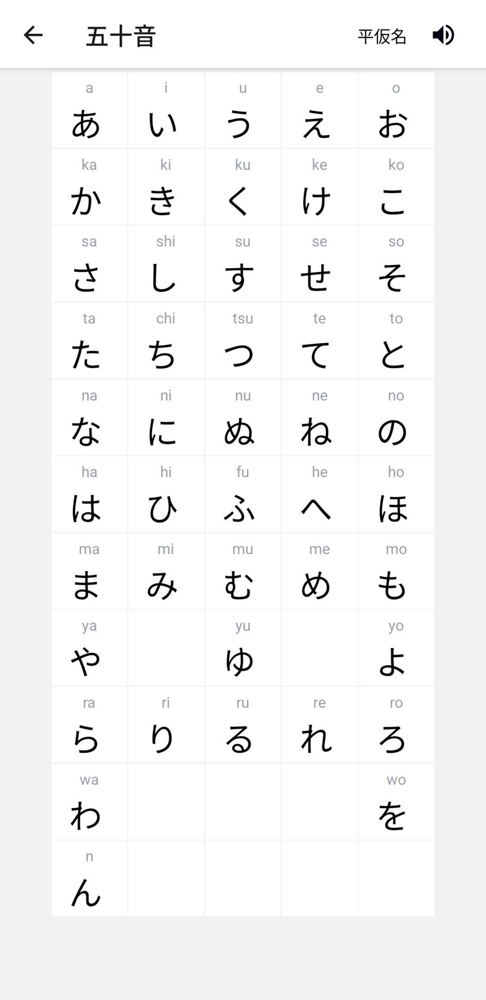
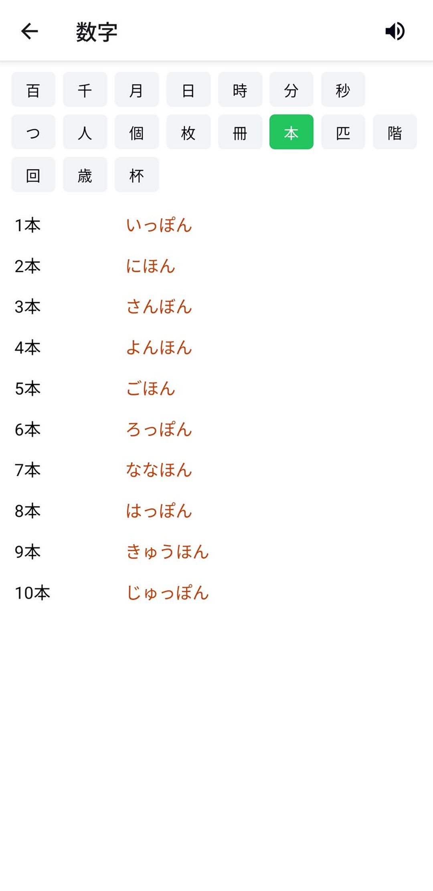
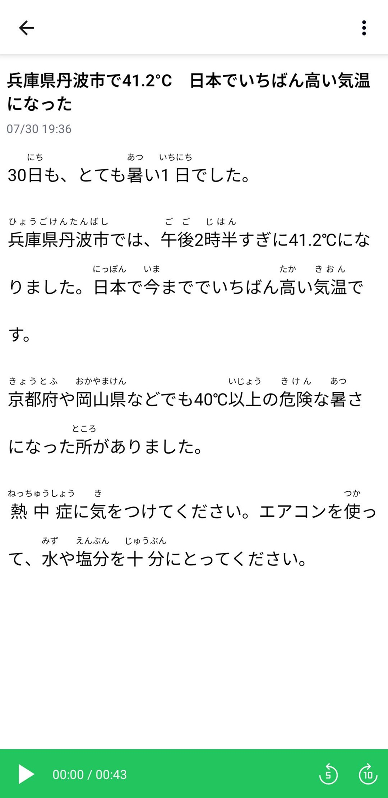

# Jamu

An app to help learn Japanese.

[](https://play.google.com/store/apps/details?id=jp.nonbili.jamu)
[](https://f-droid.org/packages/jp.nonbili.jamu/)
[](https://github.com/nonbili/Jamu/releases/latest)

## Features

- Gojuon (五十音)
- Numbers (数字)
- NHK Easy News
- Quiz
- Trivia (豆知識)

## Screenshots

    

## Development

```
bun install
bun dev
bun run android
```
